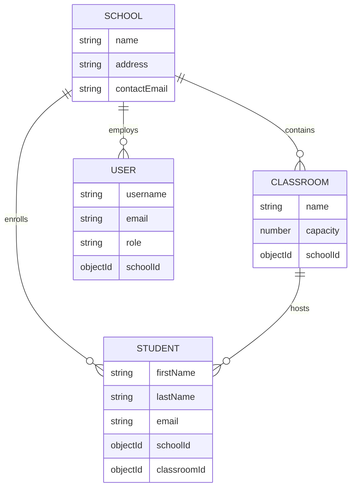

# School Management System API

An Axion-based backend for managing schools, classrooms, and students with robust RBAC and security features.

## 🚀 Quick Start

### Prerequisites
- **Node.js**: v16+ 
- **MongoDB**: Local or Atlas URI (Mongoose v6+)
- **Redis**: Required for Rate Limiting and Orchestration

### Installation
```bash
npm install
```

### Environment Setup
Create a `.env` file in the root based on the configuration in `config/envs/`:
```env
USER_PORT=5111
MONGO_URI=mongodb://localhost:27017/school_system
CACHE_REDIS=redis://127.0.0.1:6379
CORTEX_REDIS=redis://127.0.0.1:6379
OYSTER_REDIS=redis://127.0.0.1:6379
LONG_TOKEN_SECRET=your_long_lived_secret
SHORT_TOKEN_SECRET=your_short_lived_secret
SERVICE_NAME=axion-school-api
```

### Data Seeding
Seed the initial Superadmin user to bootstrap the system:
```bash
npm run seed:admin
# Default Credentials: superadmin@school.com / admin123
```

### Running the Server
```bash
# Development mode
npm run dev

# Production mode
npm start
```

### Running Tests
The project includes a comprehensive test suite (Unit & Integration):
```bash
# Run all tests
npm test

# Run with open handle detection
npm run test:debug
```

## 📚 Documentation
- **Swagger UI**: [http://localhost:5111/docs](http://localhost:5111/docs)
- **Architecture**: See `Solution.MD` for detailed implementation logic.

## 🏗 Entity Relationship Diagram



## 🔒 Security & Architecture Decisions

### Multi-Layered RBAC (SharkFin)
Access control is managed via a hierarchical permission system:
- **Superadmin**: Full wild access to all resources (Schools, Users, etc.).
- **School Admin**: Restricted to their assigned `schoolId`. They can manage classrooms and students within their domain.
- **Inheritance**: Permissions cascade from schools to nested resources (classrooms/students).

### Authentication Strategy
Uses a dual-token strategy:
- **Long Token**: Acts as a "Refresh Token" or persistent session.
- **Short Token**: Short-lived access token used for API requests, providing enhanced security against token theft.

### Input Validation (Qantra Pineapple)
Every request is validated against strict schemas defined in `user.schema.js`, `school.schema.js`, etc. This prevents NoSQL injection and ensures data integrity.

### Resilience & Scalability
- **Rate Limiting**: Redis-backed protection prevents brute-force and DDoS attempts.
- **Manager-Loader Pattern**: Decouples business logic from delivery mechanisms (HTTP/CLI/Cortex).
- **In-Memory Testing**: Integration tests use `mongodb-memory-server` for isolated, fast, and reliable CI/CD pipelines.

### Redis Client Strategy
The system uses **two Redis clients intentionally**:
- **node-redis (`redis` package)** → Used exclusively for `express-rate-limit` via `rate-limit-redis`.
- **ioredis** → Used for Cortex, Oyster, and internal caching/orchestration.

This separation is required because `rate-limit-redis` is designed specifically for `node-redis`. Using `ioredis` with it can cause runtime failures such as:

TypeError: unexpected reply from redis client

Keeping the clients isolated ensures **production stability** and **predictable behavior** across environments.


## 📝 Assumptions
- A Superadmin is required to create the first School and its respective School Admin.
- Redis is available for rate limiting; the system falls back gracefully in test environments.
- Each School Admin is strictly bound to one School.
